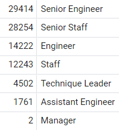
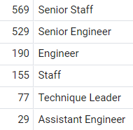
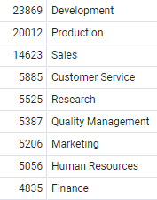
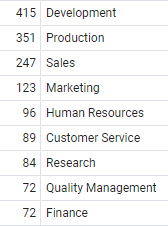

# Pewlett-Hackard-Analysis

## Overview of the analysis:
The purpose of this analysis is to determine the number of retiring employees per title, and identify employees who are eligible to participate in a mentorship program.

## Results:

### Number of Retiring Employees by Title

The purpose of this analysis is to identify all the titles of current employees who were born between January 1, 1952 and December 31, 1955. This information will help the company to identify the employees that are eligible for a retirement package. It will also provide a list of positions that will need to be filled in the near future.

- Of the 300,024 employees currently working for the company, 30.13% (90,398 employees) are eligible to retire. 
- The majority of the retirement-eligible employees are in senior positions like Senior Engineer and Senior Staff.

Below is the breakdown by title:

### Employees Eligible for the Mentorship Program

The purpose of this analysis is to determine employee eligibility for a mentorship program, by identify the current employees who were born between January 1, 1965 and December 31, 1965.

- 1,549 employees (0.5% of the entire workforce) were born between January 1, 1965 and December 31, 1965 and are eligible for participating in the mentorship program.
- The majority of the mentorship-eligible employees are in senior positions like the ones that are needed to fulfill the employees that are going to retire.

Below is the breakdown by title:

## Summary:

The company needs to be prepared to fill the vacancies of 90,398 employees in 7 different roles spread across 9 departments. The retirement-ready employees can mentor the current employees that are elegible for mentorship in each department, but the company will also need to hire additional employees to fulfill its workforce.

Retiring Departments:

Mentorship Departments:

